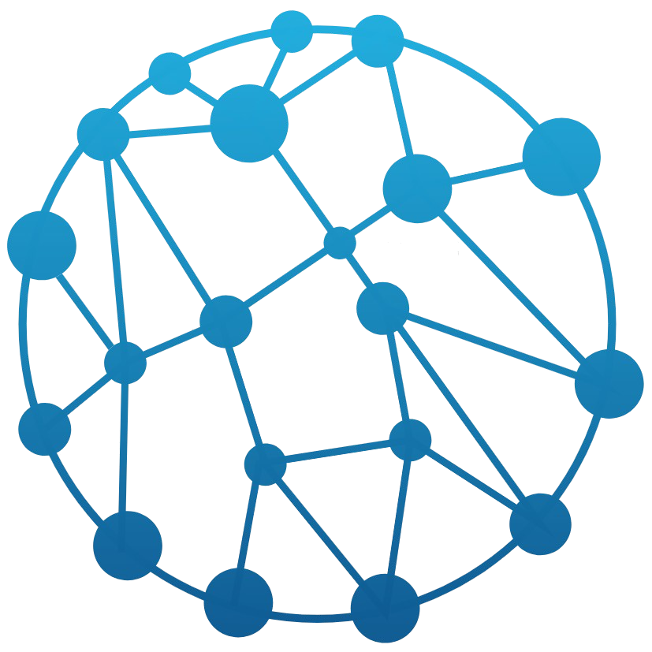

<h1 align="center">ASW Chart - Customized Highcharts Charts.</h1>

<p align="center">
  
  <br>
  <i>ASW Chart helps you to implement charts with less time
    <br> using Angular and Bootstrap.</i>
  <br>
</p>

<p align="center">
  <a href="https://asoftwareworld.github.io/charts"><strong>https://asoftwareworld.github.io/charts</strong></a>
  <br>
</p>

<p align="center">
  <a href="CONTRIBUTING.md">Contributing Guidelines</a>
  ·
  <a href="https://github.com/asoftwareworld/asw-charts/issues">Submit an Issue</a>
  ·
  <a href="https://asoftwareworld.github.io">Blog</a>
  <br>
  <br>
</p>

<p align="center">
  <a href="https://circleci.com/gh/asoftwareworld/ASW-charts">
    
  </a>&nbsp;
  <a href="https://www.npmjs.com/package/@asoftwareworld/form-builder">
    
  </a>&nbsp;
  <a href="https://github.com/asoftwareworld/ASW-charts/blob/master/LICENSE">
    
  </a>
</p>

<hr>

# Documentation

`ASW Form Builder` helps you with rapid development and designed web forms which includes several controls. The key feature of `Form Builder` is to make your content attractive and effective. We can customize our control at run time and preview the same before final submission.

`Form Builder` is compatible with the latest version of Angular and Angular Material. Only a few clicks can create an attractive web form and provide a JSON Schema to render all controls.

## Installation
Below are some prerequisites before install `Form Builder`.

### Step 1: Install Bootstrap
Install `Bootstrap` source Sass files by running the following command:
```html
npm install bootstrap
```

### Step 2: Install ASW Charts
Install `Form Builder` to set up in the project by running the following command:
```html
npm install @asoftwareworld/charts
```

### Step 4: Import the component modules
Import the NgModule for each component you want to use:

```
import { AswPieDonutModule } from '@asoftwareworld/charts/pie-donut';
import { AswLineModule } from '@asoftwareworld/charts/line';
import { AswBarColumnModule } from '@asoftwareworld/charts/bar-column';
// ...

@NgModule({
  imports: [
    // shown passing global defaults (optional)
    AswPieDonutModule,
    AswLineModule,
    AswBarColumnModule
    ...
  ]
  // ...
})
export class AppModule {}
```

## Add a selector to HTML
In your template, use the component selector:
```
<div class="row">
    <div class="col-md-6">
        <asw-pie-donut 
            [config]="config"
            [label]="label"
            [amount]="amount"
            [currencyCode]="currencyCode"
            [isLegendSort]="isLegendSort"
            [legendType]="legendType"
            [legendLayout]="legendLayout"
            (donutSliceClick)="donutSliceClick($event)">
        </asw-pie-donut>
    </div>
    <div class="col-md-6">
        <asw-line
            [config]="lineConfig"
            [currencyCode]="currencyCode"
            [isLegendSort]="isLegendSort"
            [legendType]="lineChartLegendType"
            [legendLayout]="legendLayout"
            [legendPosition]="legendPosition"
            [isLegendDisplay]="isLegendDisplay"
            (linePointClick)="linePointClick($event)">
        </asw-line>
    </div>
</div>
<div class="row">
    <div class="col-md-6">
        <asw-bar-column
            [config]="barChartConfig"
            [isLegendSort]="isLegendSort"
            [legendLayout]="legendLayout"
            [legendPosition]="legendPosition"
            (barClick)="barClick($event)">
        </asw-bar-column>
    </div>
</div>
```

Define in your component to get published event :

```
export class AppComponent implements OnInit {
    isLegendSort = true;
    title = 'Donut chart';
    label: string | undefined;
    currencyCode = CurrencyCodeEnum.INR;
    legendLayout = LegendLayoutEnum.Vertical;
    amount: number | null | undefined = -345345;
    legendType = PieLegendTypeEnum.Both;
    lineChartLegendType = ChartLegendTypeEnum.Both;
    legendPosition = LegendPositionEnum.Right;
    isLegendDisplay = true;
    config: Options = {
        chart: {
            type: 'pie'
        },
        colors: ['#FAD331', '#96D5DF', '#1BA8BB', '#C5D930', '#C1A0C5'],
        plotOptions: {
            series: {
                marker: {
                    enabled: false
                },
                dataLabels: {
                    enabled: false
                }
            }
        },
        series: [
            {
                type: 'pie',
                name: 'Price',
                data: [
                    {
                        id: '1',
                        name: 'Fuel',
                        y: 7450.00
                    },
                    {
                        id: '2',
                        name: 'Lubricants',
                        y: 435.00,
                    },
                    {
                        name: 'Road Services',
                        y: 200.87,
                        id: '3',
                    },
                    {
                        name: 'Food',
                        y: 45.67,
                        id: '4',
                    },
                    {
                        name: 'Shop',
                        y: 42.45,
                        id: '5',
                    }
                ]
            },
        ]
    };

    semiCircleDonut: Options = {
        chart: {
            type: 'solidgauge'
        },
        title: undefined,

        pane: {
            center: ['50%', '85%'],
            size: '140%',
            startAngle: -90,
            endAngle: 90,
            background: [{
                backgroundColor: '#EEE',
                innerRadius: '60%',
                outerRadius: '100%',
                shape: 'arc'
            }]
        },

        exporting: {
            enabled: false
        },

        tooltip: {
            enabled: false
        },

        // the value axis
        yAxis: {
            stops: [
                [0.1, '#55BF3B'], // green
                [0.5, '#DDDF0D'], // yellow
                [0.9, '#DF5353'] // red
            ],
            lineWidth: 0,
            tickWidth: 0,
            minorTickInterval: null,
            tickAmount: 2,
            title: {
                y: -70
            },
            labels: {
                y: 16
            }
        },

        plotOptions: {
            solidgauge: {
                dataLabels: {
                    y: 5,
                    borderWidth: 0,
                    useHTML: true
                }
            }
        }
    };

    lineConfig: Options = {
        title: {
            text: 'Solar Employment Growth by Sector, 2010-2016'
        },

        subtitle: {
            text: 'Source: thesolarfoundation.com'
        },

        yAxis: {
            title: {
                text: 'Number of Employees'
            }
        },

        xAxis: {
            accessibility: {
                rangeDescription: 'Range: 2010 to 2017'
            }
        },

        plotOptions: {
            series: {
                label: {
                    connectorAllowed: false
                },
                pointStart: 2010
            }
        },

        series: [{
            type: 'line',
            name: 'Installation',
            data: [43934, 52503, 57177, 69658, 97031, 119931, 137133, 154175]
        }, {
            type: 'line',
            name: 'Sales & Distribution',
            data: [11744, 17722, 16005, 19771, 20185, 24377, 32147, 39387]
        }, {
            type: 'line',
            name: 'Manufacturing',
            data: [24916, 24064, 29742, 29851, 32490, 30282, 38121, 40434],
        }, {
            type: 'line',
            name: 'Project Development',
            data: [null, null, 7988, 12169, 15112, 22452, 34400, 34227]
        }, {
            type: 'line',
            name: 'Other',
            data: [12908, 5948, 8105, 11248, 8989, 11816, 18274, 18111]
        }],

        responsive: {
            rules: [{
                condition: {
                    maxWidth: 500
                },
                chartOptions: {
                    legend: {
                        layout: 'horizontal',
                        align: 'center',
                        verticalAlign: 'bottom'
                    }
                }
            }]
        }
    };

    barChartConfig: Options = {
        chart: {
            type: 'column'
        },
        title: {
            text: 'Monthly Average Rainfall'
        },
        subtitle: {
            text: 'Source: WorldClimate.com'
        },
        xAxis: {
            categories: [
                'Jan',
                'Feb',
                'Mar',
                'Apr',
                'May',
                'Jun',
                'Jul',
                'Aug',
                'Sep',
                'Oct',
                'Nov',
                'Dec'
            ],
            crosshair: true
        },
        yAxis: {
            min: 0,
            title: {
                text: 'Rainfall (mm)'
            }
        },
        tooltip: {
            headerFormat: '<span style="font-size:10px">{point.key}</span><table>',
            pointFormat: '<tr><td style="color:{series.color};padding:0">{series.name}: </td>' +
                '<td style="padding:0"><b>{point.y:.1f} mm</b></td></tr>',
            footerFormat: '</table>',
            shared: true,
            useHTML: true
        },
        plotOptions: {
            column: {
                pointPadding: 0.2,
                borderWidth: 0
            }
        },
        series: [{
            type: 'column',
            name: 'Tokyo',
            data: [49.9, 71.5, 106.4, 129.2, 144.0, 176.0, 135.6, 148.5, 216.4, 194.1, 95.6, 54.4]

        }, {
            type: 'column',
            name: 'New York',
            data: [83.6, 78.8, 98.5, 93.4, 106.0, 84.5, 105.0, 104.3, 91.2, 83.5, 106.6, 92.3]

        }, {
            type: 'column',
            name: 'London',
            data: [48.9, 38.8, 39.3, 41.4, 47.0, 48.3, 59.0, 59.6, 52.4, 65.2, 59.3, 51.2]

        }, {
            type: 'column',
            name: 'Berlin',
            data: [42.4, 33.2, 34.5, 39.7, 52.6, 75.5, 57.4, 60.4, 47.6, 39.1, 46.8, 51.1]

        }]
    };

    ngOnInit(): void {

    }

    donutSliceClick(event: PointClickEvent): void {
        this.label = event.name;
        this.amount = event.value;
        console.log(event);
    }

    linePointClick(event: ChartPointerEvent): void {
        console.log(event);
    }

    barClick(event: ChartPointerEvent): void {
        console.log(event);
    }
}
```
## Theme
and Bootstrap [more information](https://getbootstrap.com/docs/4.0/getting-started/theming/)

## Browser Support

|  |  |  |  |  | 
| ---------------------------------------------------------------------------------------- | ------------------------------------------------------------------------------------------- | ---------------------------------------------------------------------------------------- | ------------------------------------------------------------------------------------- | ---------------------------------------------------------------------------------- | 
| Latest ✔                                                                                 | Latest ✔                                                                                    | Latest ✔                                                                                 | Latest ✔                                                                              | Latest ✔                                                                                                                                                                                                    |
## [Report a bug](https://github.com/asoftwareworld/ASW-Form-Builder/issues)
We use GitHub Issues as the official bug tracker for the ASW Form Builder. Here are some advices for our users that want to report an issue:

1. Make sure that you are using the latest version of the ASW Form Builder.
2. Providing us reproducible steps for the issue will shorten the time it takes for it to be fixed.
3. Some issues may be browser specific, so specifying in what browser you encountered the issue might help.

## Technical Support or Questions
If you have questions or need help please email `asoftwareworld@gmail.com`

## License
[MIT](https://github.com/asoftwareworld/asw-charts/blob/main/LICENSE)

## Social Media

Twitter: <https://twitter.com/asoftwareworld>

LinkedIn: <https://in.linkedin.com/company/asoftwareworld>

Facebook: <https://www.facebook.com/asoftwaresworld>

(https://github.com/asoftwareworld/ASW-Charts)

**Love ASW Charts? Give our repo a star :star: :arrow_up:.**

## Donate
<a href="https://paypal.me/asoftwaresworld?locale.x=en_GB"></a>  
If this project help you reduce time to develop, you can give me a cup of coffee :)
